# Top 18 Self-Cleaning Water Bottles Ranked in 2025 (Latest Update)

Your reusable water bottle smells funky after a week, bacteria builds up faster than you can scrub it, and you're never quite sure if that hiking stream water is safe to drink. Traditional bottles require constant washing and don't address water quality concerns when filling from questionable sources. Self-cleaning UV-C water bottles and advanced filtration systems solve both problems by purifying water at the touch of a button while automatically sanitizing the bottle interior. Whether you're hiking backcountry trails, traveling internationally, or just want cleaner water at the gym, these smart bottles eliminate odor-causing bacteria and remove contaminants without the hassle of manual cleaning.

## **[WAATR](https://waatr.com)**

Award-winning 4D water treatment with three customizable filter options.

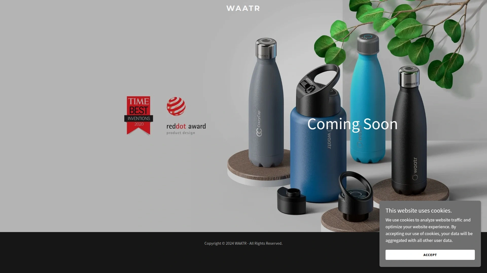

WAATR's PureMax 4D earned the prestigious Red Dot Design Award for its innovative approach to portable water treatment. The system combines 20 mW Dual UV-C LEDs with three unique filter options, letting you tailor filtration based on your water source and preferences. The 4D technology treats water fast and conveniently while you're on the go, eliminating the wait times common with other purification methods. True self-cleaning functionality means easy maintenance—the UV-C LEDs automatically sanitize the bottle interior, preventing bacteria buildup and eliminating odors without manual scrubbing. WAATR backs the product with a comprehensive 10-year warranty, demonstrating confidence in long-term durability. The company's mission centers on bringing water back to its most natural state by treating and filtering at the touch of a button, removing impurities that accumulate during processing, packaging, and storage. Carbon filter integration addresses taste and chemical concerns beyond biological contaminants. Best suited for users wanting customizable filtration strength combined with automated cleaning rather than one-size-fits-all purification.

## **[LARQ](https://www.livelarq.com)**

Premium two-stage purification with removable filtered straw.

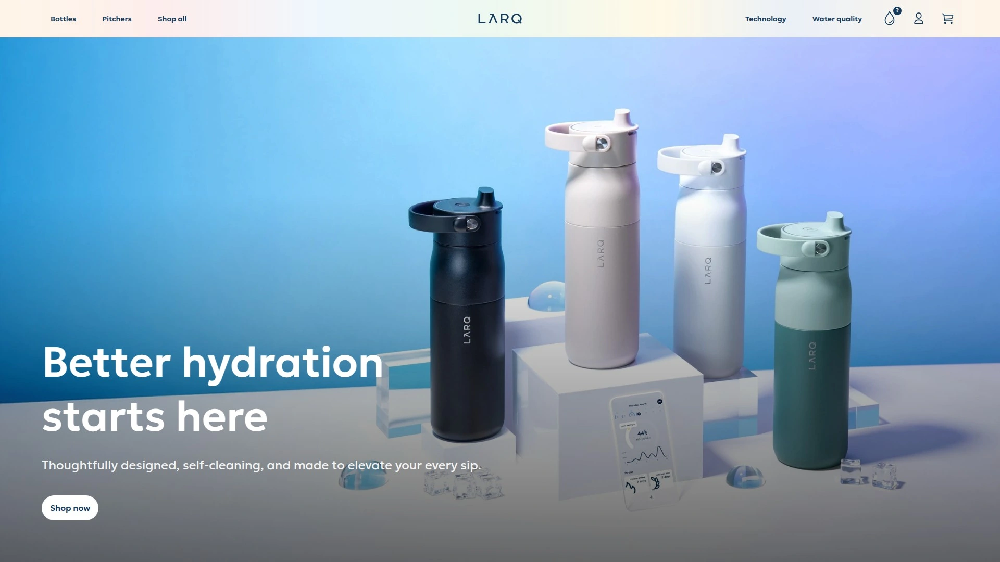

LARQ Bottle PureVis 2 delivers the most comprehensive self-cleaning water bottle solution at $109, offering both UV-C light purification and an optional Advanced Bottle Filter. The UV-C technology neutralizes up to 99.9999% of harmful, odor-causing bacteria automatically every two hours, eliminating at least 99.9% of bio-contaminants like salmonella, E. coli, and staphylococcus. The removable filtered straw removes PFOS, PFOA, chlorine, heavy metals, and additional contaminants through plant-based Nano Zero technology. Adventure mode increases UV-C intensity for questionable water sources where quality remains unclear. The bottle keeps water cold for 24 hours or hot for 12 hours with vacuum insulation. USB charging provides up to one month of battery life per charge. Available in 17-ounce and 25-ounce capacities with multiple color options. Personalization adds up to 10 letters for $15 extra. Third-party testing rigorously verifies performance claims. The colored light system indicates operating mode and cycle status. Featured on Shark Tank, increasing brand recognition and trust. Premium pricing justified by dual-stage purification unavailable in cheaper alternatives.

## **[CrazyCap](https://crazycap.com)**

Powerful 20 mW LED with lifetime warranty and no filter replacements.

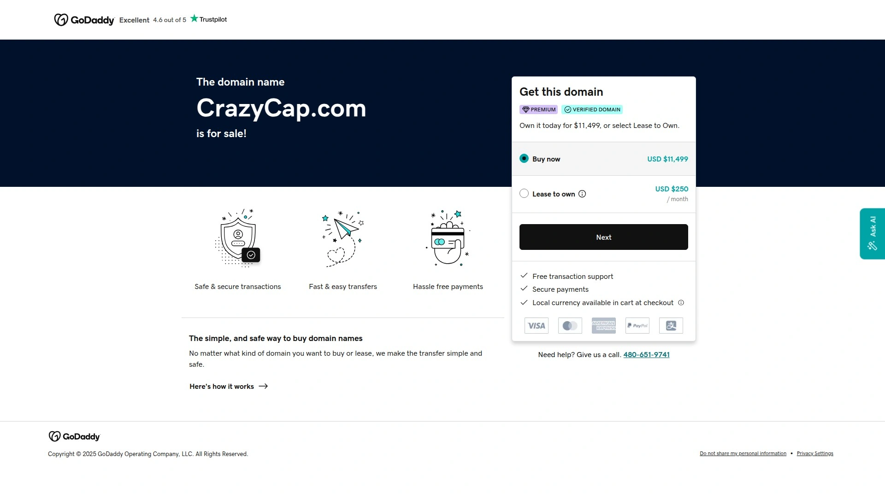

CrazyCap stands out with its powerful 20 mW LED UV light built into the bottle lid, destroying all pathogens including bacteria, viruses, and protozoa in collected water. The system requires no filter replacements—just tap the lid twice to activate purification. Normal Mode completes purification in 60 seconds, while Crazy Mode delivers 120-second sterilization for heavily contaminated sources. The battery lasts up to two months on a single charge when using auto-clean mode daily. The cap fits cola-style bottles like S'Well, Chilly's, and Mira, offering flexibility beyond purchasing their proprietary bottle. Complete bottle systems start at $99 for 17 ounces or $119 for 25 ounces. Aluminum construction provides durability while keeping weight manageable. Lifetime warranty removes long-term replacement concerns. Annual costs remain virtually zero since no consumable filters require purchasing. Best for users prioritizing biological contaminant removal over taste and chemical filtration. The auto-clean feature prevents bacteria buildup without user intervention. Compatibility with existing premium bottles reduces waste if you already own quality insulated containers.

## **[Philips GoZero](https://www.philips.com)**

Automatic activation every two hours with 30-day battery life.

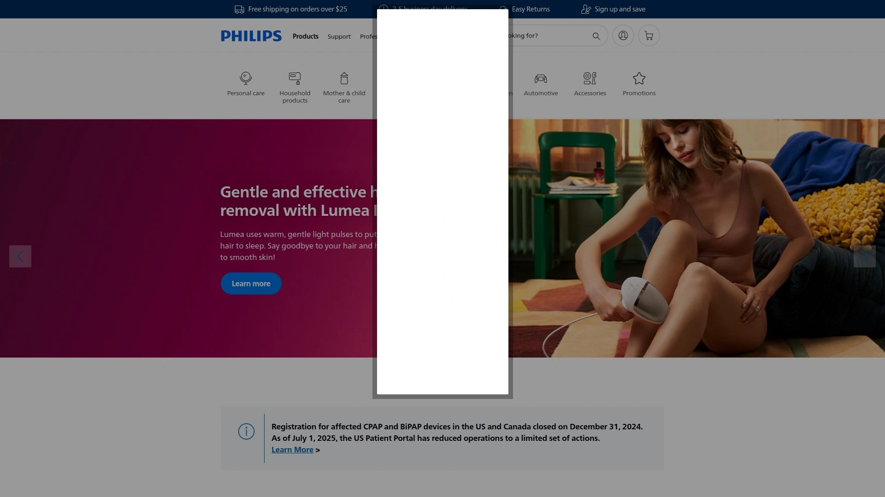

Philips Water GoZero UV Self-Cleaning Smart Water Bottle features UV light that activates automatically every two hours, keeping beverages clean and odor-free without manual intervention. The system kills 99.99% of bacteria and viruses using UV-C technology. Battery life extends up to 30 days on a single USB charge, reducing charging frequency during extended trips. Hot beverages maintain optimal temperature for 12 hours, while cold beverages stay chilled for 24 hours through double-wall stainless steel vacuum insulation. The 12-ounce capacity suits commuters and gym-goers wanting compact portability. Clean design with minimal external elements simplifies aesthetics. Odor-free performance addresses the primary complaint about reusable bottles—that musty smell developing after repeated use. Leak-proof construction prevents spills in bags and backpacks. Handle attachment point facilitates easy carrying. The automatic two-hour cycle ensures water and bottle interior remain fresh throughout the day without remembering to activate purification modes.

## **[UVBrite](https://uv-brite.com)**

Medical-grade purification with self-cleaning cycle every six hours.

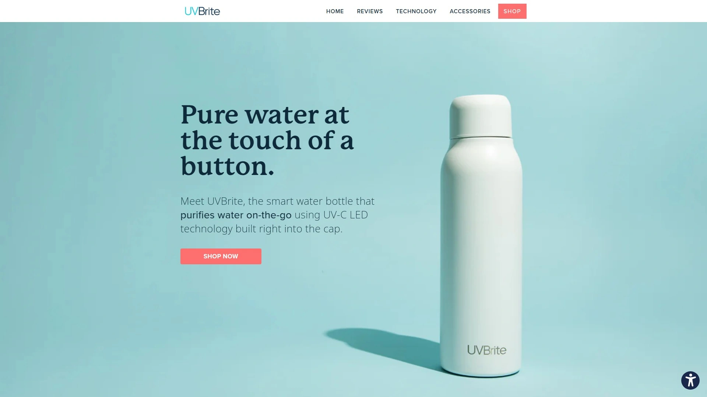

UVBrite uses UV-C LED to purify water, eliminating up to 99.99% of germs in 90 seconds by destroying their DNA at the cellular level. The bottle runs a self-cleaning cycle automatically every six hours, maintaining interior hygiene without user input. Pure water accessible at the touch of a button makes it simple to operate even for non-technical users. The 2025 market update positions UVBrite as a leader in UV-C LED-based self-cleaning hydration systems, with growing adoption rates demonstrating consumer confidence. Medical-grade purification standards exceed typical consumer bottle requirements, making it suitable for international travel where water quality varies dramatically. The button-activated system provides control over when additional purification happens beyond automatic cycles. Best for travelers and outdoor enthusiasts needing reliable water safety without complex filtration setup. The six-hour automatic cycle frequency balances battery life with cleanliness maintenance.

## **[Nordic Pure Wave](https://thenordicwave.com)**

Budget-friendly UV-C with six to eight weeks battery life.

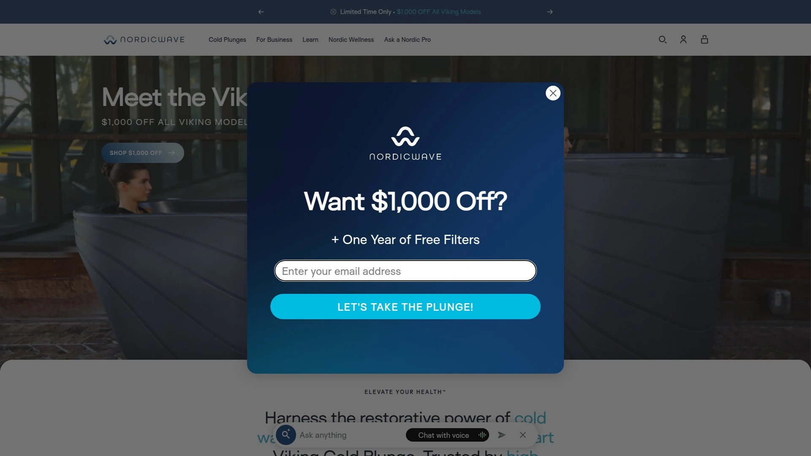

Nordic UVC Self-Cleaning Water Bottle combines UV-C purification, vacuum insulation, and self-cleaning technology in a travel-ready design priced more affordably than premium competitors. The integrated UV-C light eradicates up to 99.99% of bacteria and viruses in just 60 seconds. Single USB-C charge provides six to eight weeks of battery life—nearly double the one-month standard of pricier alternatives. Daily use maintains the bottle's own cleanliness automatically, preventing harmful germ buildup. Stainless steel construction ensures durability and a sleek modern look. Vacuum insulation keeps beverages cold for up to 24 hours or hot for up to 12 hours. The 20 fluid ounce capacity with dimensions of 8x8x32 cm balances portability with hydration needs. Eco-friendly reusable design reduces plastic waste while delivering unparalleled performance. The combination of long battery life and effective purification makes it practical for extended camping trips or international travel where charging opportunities remain limited.

## **[Grayl GeoPress](https://grayl.com)**

French press-style filtration removing viruses, chemicals, and heavy metals.

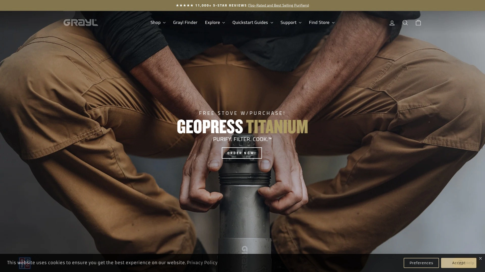

Grayl GeoPress delivers the most comprehensive filtration capability among portable bottles, removing protozoa, bacteria, viruses, chemicals, pesticides, and heavy metals while improving water taste, smell, and clarity. The unique French press-style filtration system presses water through the purifier cartridge attached to the inner cup, filtering before drinking rather than during consumption. This method allows sharing filtered water with others and using it in cooking. The one-way valve prevents liquid backflow, enabling use with hydration mixes—something impossible with straw-based filters. Filtration takes mere seconds, faster than many competitors requiring extended wait times. The 24-ounce GeoPress costs around $100 and weighs 15.9 ounces—heavier than basic bottles but justified by robust filtration. Food-grade plastic and silicone construction with protective rubber base band withstands drops onto rocky surfaces. Not dishwasher safe but the wide opening facilitates hand washing. Ideal for international travel, backcountry camping, and anywhere water quality remains questionable. Replaceable filter cartridges mean long-term use without replacing the entire bottle.

## **[LifeStraw Peak](https://www.lifestraw.com)**

Fast squeeze bottle with hollow fiber membrane removing bacteria.

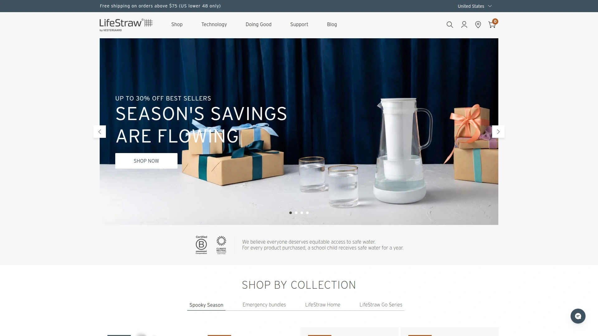

LifeStraw Peak Series Squeeze Bottle uses proven hollow fiber membrane filtration technology removing 99.99999% of bacteria and 99.9999% of protozoa including giardia and cryptosporidium. The squeeze design delivers fast flow rates, letting you drink as quickly as you can squeeze. Lightweight and compact, it works well for ultralight backpacking where every ounce matters. Compatible with standard water bottles, expanding versatility beyond the included container. The straw-based design filters as you drink, keeping unfiltered water separated from clean water. LifeStraw's reputation for reliability in developing countries and emergency situations translates to trusted performance for outdoor recreation. Significantly cheaper than UV-C bottles and comprehensive filter systems like Grayl. Best for hikers and backpackers prioritizing weight savings over chemical and virus removal. The squeeze bottles require less effort than sipping through dense filters. Field maintainable with proper backflushing techniques. Multiple users can share filtered water by squeezing into other containers.

## **[Epic Water Filters Nalgene OG](https://www.epicwaterfilters.com)**

Patented CoreXchange Technology removing 200+ contaminants.

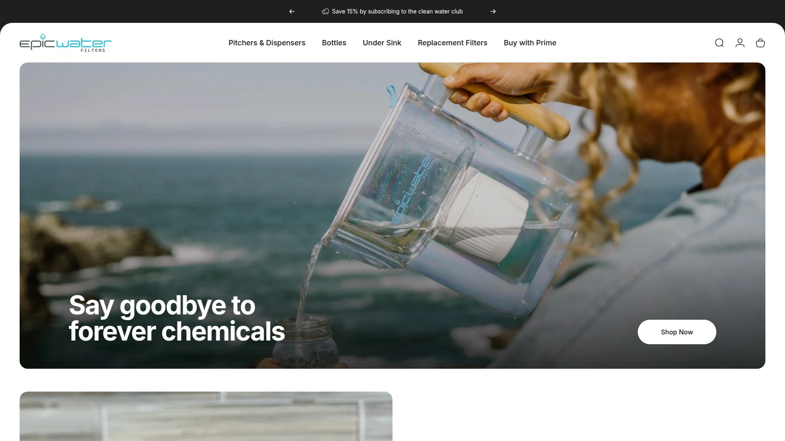

Epic Water Filters Everywhere Filter System integrates seamlessly with Nalgene Wide Mouth bottles, providing retrofittable filtration for bottles you already own. The patented CoreXchange Technology removes more than 200 contaminants from both tap water (chlorine, microplastics, lead, PFAS) and outdoor water (bacteria, virus, cryptosporidium, giardia). Each replaceable filter cartridge delivers 75 gallons of clean water or approximately four months of daily use. Compatible with 24-ounce, 32-ounce, and 48-ounce Wide Mouth Nalgene bottles. The Easy Sip Lid with straw makes drinking convenient. Filter system costs $34-35 depending on bottle size, with replacement cartridges at $30 each or $50 for two-packs. Designed and made in the USA, supporting domestic manufacturing. Each filter replaces the equivalent of 550+ plastic bottles, addressing environmental concerns. The multi-layered filter targets a wider contaminant range than basic carbon filters. Best for Nalgene owners wanting to add filtration capability without buying entirely new bottles. Filters are 100% recyclable at end of life.

## **[Clearly Filtered](https://www.clearlyfiltered.com)**

NSF-certified removing most contaminants of any portable filter.

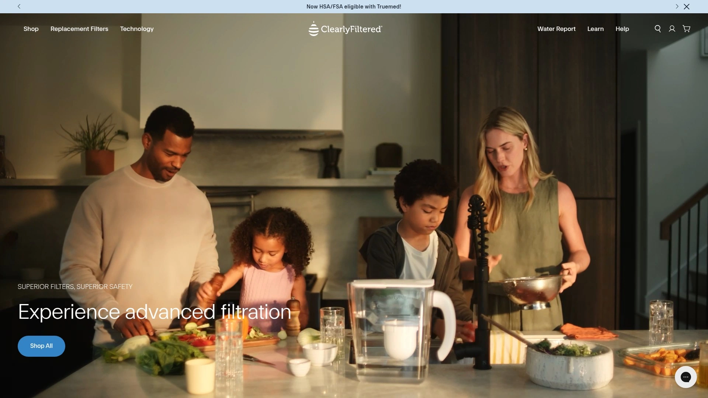

Clearly Filtered Insulated Stainless Steel Filtered Water Bottle ranks as the best option for city water, removing more contaminants than competitors through NSF-certified filtration. The system targets hundreds of specific chemicals and heavy metals found in municipal water supplies. Insulated stainless steel construction keeps water cold for extended periods. Designed for daily use rather than backcountry survival, making it ideal for people wanting cleaner tap water at work, gym, or while commuting. The filtration happens through the straw as you drink, requiring no pressing or squeezing. Easy to clean with replaceable filter cartridges maintaining performance over time. Premium pricing reflects comprehensive filtration capability exceeding basic carbon filters. Best suited for health-conscious users concerned about tap water quality but not requiring virus removal. The bottle prioritizes chemical and heavy metal reduction over biological contaminant removal. Reliable performance in urban and suburban settings where biological contamination remains unlikely.

## **[Brita](https://www.brita.com)**

Affordable filtered bottles with wide retail availability.

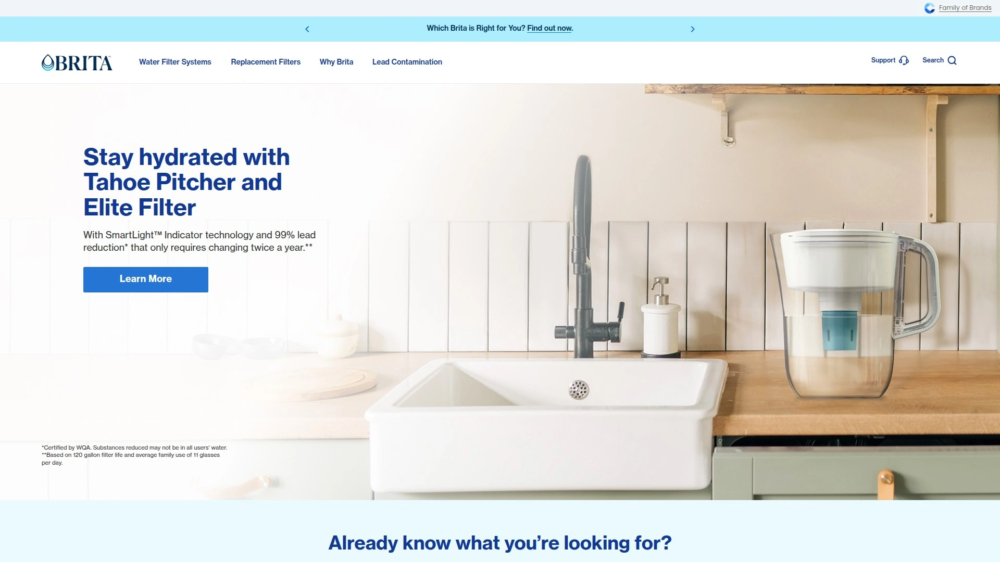

Brita Premium Filtering Water Bottles range from 20-ounce to 36-ounce capacities starting at $23.99, making them the most budget-friendly filtered option. Each filter lasts approximately 40 gallons or two months of typical use. The straw-based filtration removes chlorine taste and odor, improving tap water palatability. Stainless steel insulated options keep water cold, while hard-sided plastic versions reduce weight and cost. Filters up to 40 gallons before replacement keeps long-term costs manageable. Wide retail availability means replacement filters are easy to find at grocery stores, pharmacies, and big-box retailers nationwide. Best for casual users wanting better-tasting water without investing in premium purification systems. The bottles work well for gym use, office hydration, and daily commuting. Limited contaminant removal compared to advanced filters—primarily addresses taste rather than safety concerns. Dishwasher-safe bodies simplify cleaning. The established brand recognition and extensive distribution network provide convenience unavailable from specialty brands.

## **[Sawyer Squeeze](https://www.sawyer.com)**

Legendary 0.1 micron filter lasting up to 100,000 gallons.

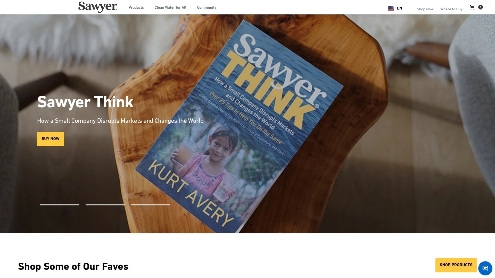

Sawyer Squeeze Water Filtration System represents the gold standard for backpacking water filtration, weighing just 3 ounces while filtering 1.7 liters per minute. The 0.1 micron absolute hollow fiber membrane removes 99.99999% of bacteria, 99.9999% of protozoa, and 100% of microplastics exceeding EPA recommendations. The filter lasts up to 100,000 gallons—essentially a lifetime investment at around $40. Compatible with standard 28mm threaded bottles, hydration pack inline systems, and gravity filtration setups. Fully field maintainable using the included backwash syringe, eliminating replacement needs. The Personal Water Bottle Filter version provides fast-as-you-can-drink flow rates. The versatile system adapts to multiple use cases from day hiking to international travel. Manufacturer's lifetime warranty demonstrates confidence in durability. The Squeeze's legendary reputation in the outdoor community stems from proven reliability over decades. Best for hikers, backpackers, and preppers prioritizing long-term value and multi-purpose functionality. The lightweight design makes it easy to carry as backup filtration.

## **[WaterH Vita](https://www.waterh.com)**

Smart tracking with TDS measurement and hydration coaching.

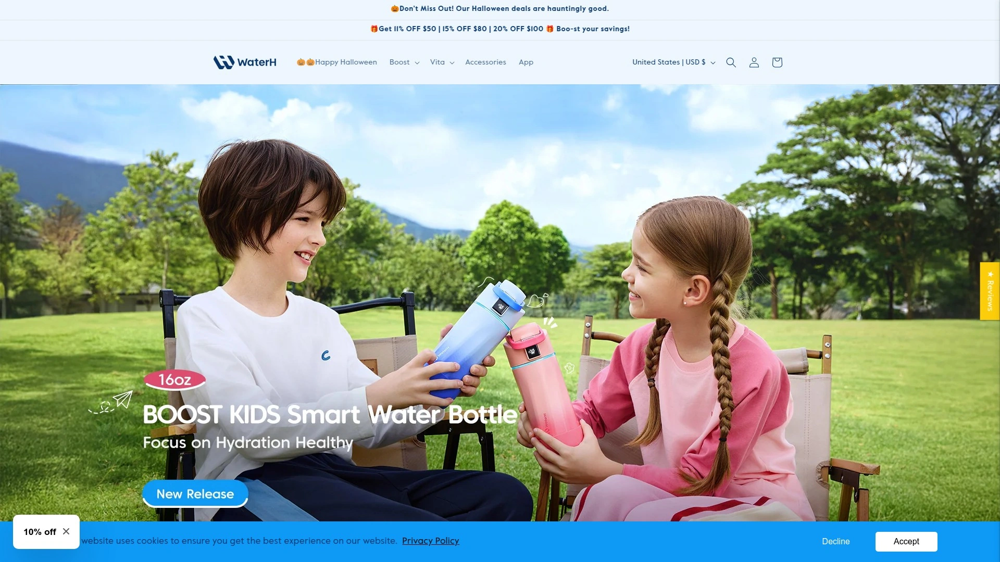

WaterH Vita Smart Bottle syncs with the WaterH app to track intake while offering optional filtration upgrades. The built-in sensor tracks hydration and sends customizable reminders through chimes, buzzes, or glows. Medical-grade dual-walled stainless steel construction with matte powder-coated finish provides durability and cupholder compatibility. Keeps beverages cold for 24 hours or hot for 12 hours. Submersible up to 1 meter for 30 minutes, withstanding accidental drops in water. The app assigns a health and hydration coach providing custom recommendations to reach personal goals. The Vita measures Total Dissolved Solids in water, indicating potential quality issues. High TDS suggests upgrading to the filtration system, which captures chlorine, pesticides, volatile organic compounds, and heavy metals. Pricing starts at $80 for bottle and filter. Best for data-driven users wanting hydration insights beyond simple reminders. The coaching features help build better drinking habits over time. Integration of water quality measurement with filtration recommendations provides unique value.

## **[CamelBak Eddy+](https://www.camelbak.com)**

Two-stage LifeStraw filtration with trusted brand reliability.

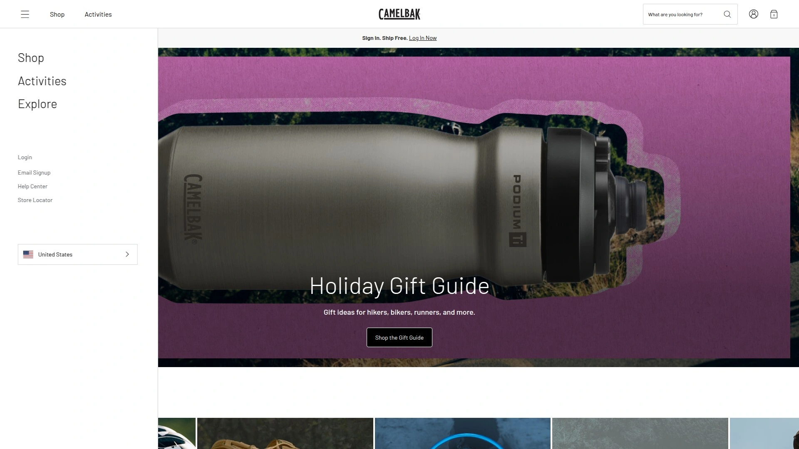

CamelBak Eddy+ filtered by LifeStraw combines CamelBak's proven bottle design with LifeStraw's filtration expertise. Two stages of filtration work together—hollow fiber filter removes bacteria, parasites, and microplastics while ion exchange filter reduces lead, taste, odor, chlorine, and other chemicals. Flip-bite-sip straw design makes drinking effortless during activities. Vacuum-insulated 18/8 stainless steel with powder coat finish provides durability and temperature retention. The 32-ounce version keeps water cold for 30 hours. Leak-proof when closed and spill-proof when open prevents accidents. Comfortable carry handle facilitates portability. Sweat-proof insulation keeps exterior dry. Filter rinses clean and bottle remains dishwasher safe for easy maintenance. BPA, BPS, and BPF-free construction ensures safety. LifeStraw and CamelBak Give Back program provides one child with one year of safe water per product purchased. The 26-ounce capacity with filter accommodates realistic hydration needs. Best for day hikers and travelers who want reliable filtration from established outdoor brands. The easy-to-use design requires minimal learning curve.

## **[Hydros](https://hydroslife.com)**

Fastest filtration speed using 100% coconut shell carbon.

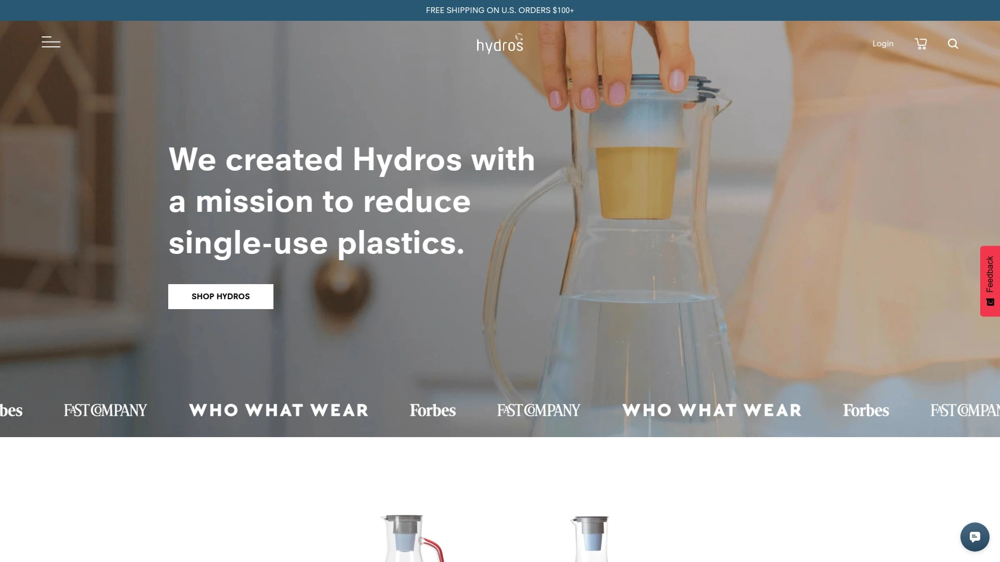

Hydros 20-ounce Water Filter Bottle filters water up to 5x faster than competitors without sacrificing quality through NSF 42/Class 1 Standard certified filters. Made from 100% coconut shell carbon in BPA-free casing, ensuring safety for users and the environment. Ready to hydrate in under 20 seconds, addressing the primary complaint about slow-filtering competitors. The Rocker Cap flips open or closed one-handed with Safety Click feature confirming secure closure to prevent leaking. Each filter fills over 600 glasses before replacement, keeping long-term costs reasonable. Born from commitment to sustainability, the products use more responsibly sourced materials and less plastic overall. Modern, beautiful design appeals to style-conscious consumers beyond basic functionality. Best for people who find other filtered bottles too slow for active lifestyles. The one-handed operation works perfectly when your other hand holds leash, phone, or gym bag. Delicious water straight from tap without funky taste or odor. Premium design justifies slightly higher pricing than basic filtered bottles.

## **[Aquamira](https://aquamira.com)**

Certified virus removal meeting EPA standards.

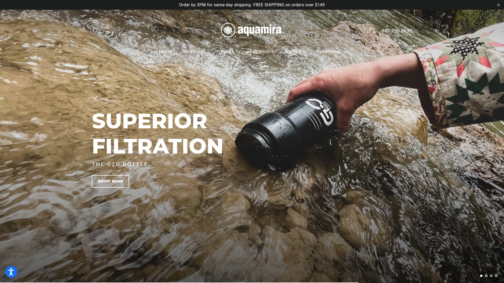

Aquamira WaterBasics RED Line Filter Bottle achieves EPA certification for removing viruses, bacteria, and parasites—rare among portable filter bottles. The certification demonstrates verified performance beyond manufacturer claims. Reduces bio toxins, chemicals, chlorine, bad taste, and odor while maintaining lead-free certification. Internal filter produces up to 120 gallons of filtered water before replacement. Two filters included with bottle purchase provides immediate backup when first filter reaches capacity. The BPA-free 22-ounce bottle features bite-me valve design protecting the mouthpiece from cross-contamination. Great carrying loop attaches to carabiners for hands-free transport on packs and gear. Flow rate delivers necessary hydration without excessive sucking force. Parts disassemble easily for cleaning—filter removes for drying, bite valve detaches for cleaning, and reservoir washes with mild soap. Best for budget-conscious users needing virus protection that most filters don't provide. The EPA certification matters for international travelers visiting areas with questionable water infrastructure. Multiple Aquamira bottle models address different capacity and filtration needs.

## **[Sans](https://www.livesans.com)**

Minimalist design with effective UV-C purification.

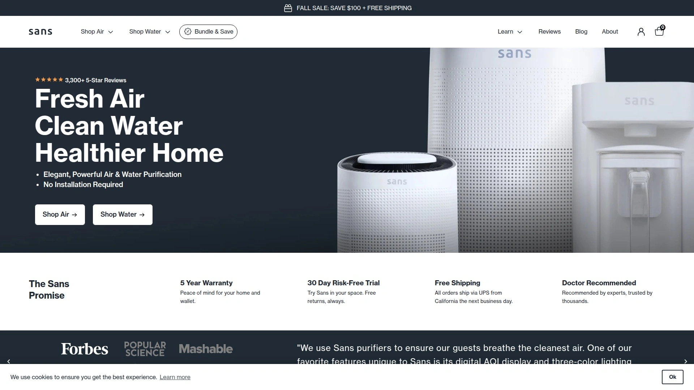

Sans Self-Cleaning Water Bottle delivers UV-C purification in a minimalist package focused on essential functionality without excessive features. The straightforward approach appeals to users wanting effective self-cleaning without app connectivity or complicated modes. UV-C technology handles sanitization automatically, preventing bacteria buildup and eliminating odors. Clean aesthetic design lacks the technical appearance of competitors, blending seamlessly into professional and casual environments. Best for users prioritizing simplicity over advanced features like water quality measurement or hydration tracking. The bottle focuses on doing one thing well—keeping water and bottle interior clean through UV-C light. Suitable for gym use, office hydration, and daily commuting where advanced filtration remains unnecessary. The minimalist philosophy extends to packaging and marketing, reducing environmental impact beyond just the reusable bottle itself.

## **[Astrea One](https://www.astrea.life)**

Wide-ranging contaminant removal including heavy metals.

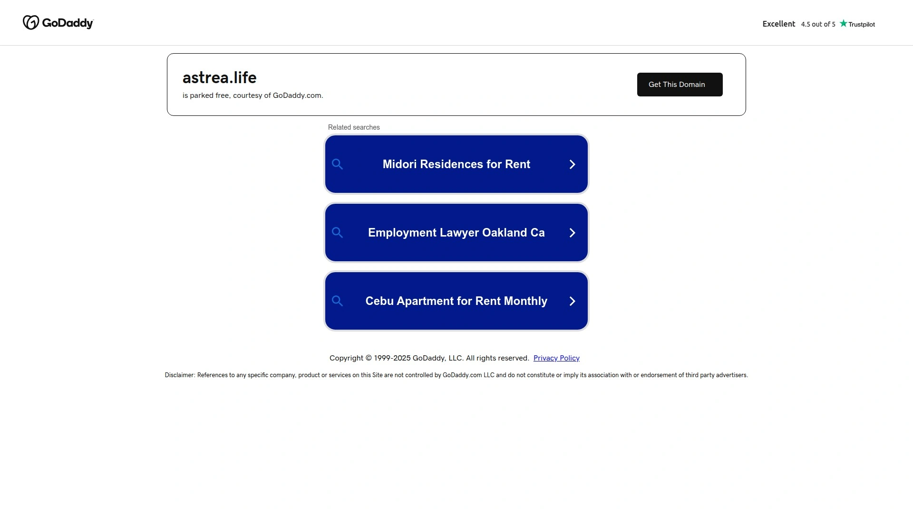

Astrea One Filtered Water Bottle removes a wide range of heavy metals and chemicals from beverages, addressing contaminants many basic filters miss. The 20-ounce double-wall insulated design maintains temperature while providing filtration. Made from BPA-free plastic that's considerably thick and sturdy, ensuring several years of reliable use. The brand advises against using water of unknown quality, positioning it more for tap water improvement than backcountry survival. Best for users concerned about municipal water quality issues like lead in aging infrastructure or agricultural runoff in rural areas. The focus on chemical and heavy metal removal differentiates it from filters targeting primarily biological contaminants. Replacement filters maintain performance over extended use. The insulated design suits users wanting both filtration and temperature control in a single bottle.

## **[Full Sail HangR UV Bottle](https://hangr.fullsail.edu)**

Compact 17-ounce UV-C sanitization at affordable price.

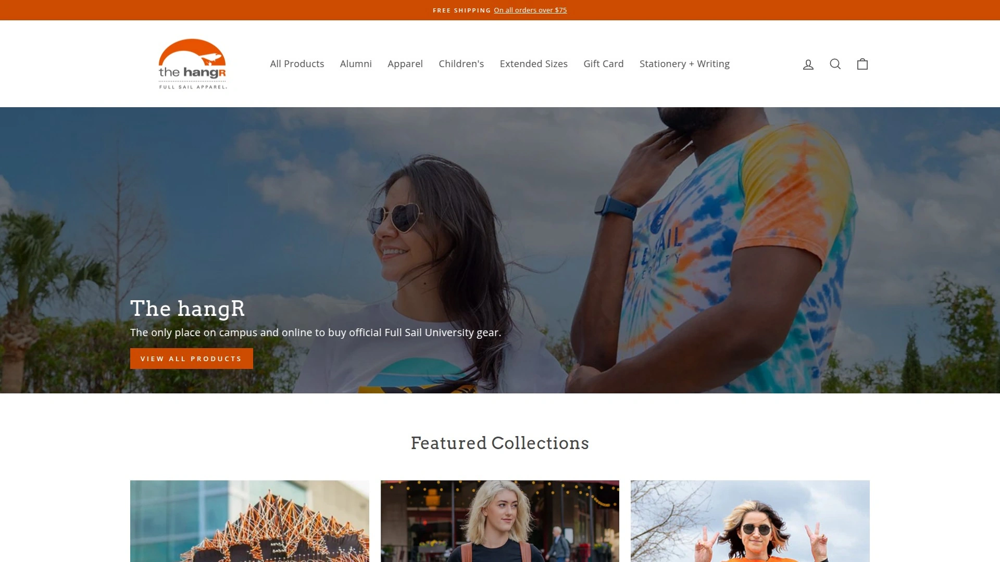

Full Sail HangR Self Cleaning UV Water Bottle - Stainless combines UV-C LED light sanitization with temperature retention in a 17-ounce compact size priced at $45. The powerful UV-C LED sanitizes the bottle interior and purifies water with a push of a button. USB rechargeable light cap eliminates battery replacement needs. Eliminates odor-causing bacteria automatically, preventing the musty smell that develops in reusable bottles. Keeps liquids hot for 12 hours or cold for 24 hours through double-walled stainless steel vacuum insulation. Non-toxic double-walled stainless steel and BPA-free construction ensures safety. The 17-ounce size suits commuters and students wanting portable purification without the bulk of larger bottles. Best for budget-conscious buyers wanting UV-C cleaning without premium pricing. The simple one-button operation requires no technical knowledge or app configuration. Suitable for gym use, office hydration, and light outdoor activities where comprehensive filtration remains unnecessary.

## FAQ

**How long does the UV-C light actually last before needing replacement?**

Most UV-C LED systems last for the lifetime of the bottle without replacement—the LEDs typically function for 10,000+ activation cycles, which translates to years of daily use. WAATR's 10-year warranty and CrazyCap's lifetime warranty demonstrate manufacturer confidence in LED longevity. You'll need to recharge the battery periodically, but the UV-C light itself won't burn out like traditional bulbs. This makes UV-C bottles more cost-effective long-term than filtered bottles requiring cartridge replacements every 2-4 months.

**Can these bottles actually remove viruses from water, or just bacteria?**

UV-C bottles like LARQ, CrazyCap, UVBrite, and Philips GoZero remove both bacteria and viruses by destroying their DNA, while most mechanical filters only catch bacteria and protozoa. Viruses are much smaller than bacteria—0.1 micron filters catch bacteria but viruses slip through at 0.02-0.3 microns. If you need virus protection, choose UV-C purification or advanced filters like Grayl GeoPress and Aquamira that specifically certify virus removal. For domestic use where tap water is already treated, bacteria-only filtration usually suffices.

**How do I know when the battery is running low on self-cleaning bottles?**

Most smart bottles display colored LED indicators showing battery status—LARQ uses colored light systems, while others like UVBrite and Philips provide low-battery warnings through app notifications or blinking lights. Battery life typically ranges from 30 days to 8 weeks depending on model and usage frequency. USB charging takes 2-3 hours to full capacity. If purification cycles stop activating automatically or the LED fails to light when pressed, the battery likely needs recharging immediately.

## Conclusion

Keeping water bottles clean and safe no longer requires daily scrubbing or worrying about contaminated water sources. The bottles above span from budget-friendly filtered options to premium UV-C purification systems, with solutions for everything from gym hydration to international backpacking. [WAATR](https://waatr.com) stands out for serious travelers and outdoor enthusiasts because the 4D water treatment technology with customizable filter options handles diverse water sources effectively, while the dual 20 mW UV-C LEDs provide true self-cleaning functionality that prevents bacteria buildup completely. The 10-year warranty demonstrates long-term reliability unavailable from most competitors, and the Red Dot Design Award recognition confirms the engineering quality that matters when you're depending on safe water far from civilization.
